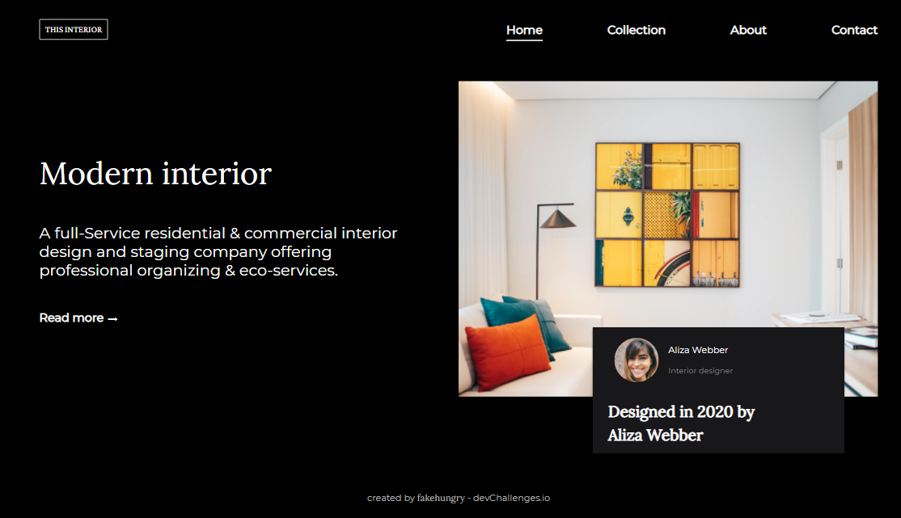

<!-- Please update value in the {}  -->

<h1 align="center">Interior Consultant</h1>

   Solution for a challenge from  <a href="http://devchallenges.io" target="_blank">Devchallenges.io</a>.

  <h3>
    <a href="https://fakehungry.github.io/dev-challenges/responsive-web-developer/interior-consultant-master/">
      Solution
    </a>
     | 
    <a href="https://devchallenges.io/challenges/Jymh2b2FyebRTUljkNcb">
      Challenge
    </a>
  </h3>

<!-- TABLE OF CONTENTS -->

## Table of Contents

- [Overview](#overview)
  - [Built With](#built-with)
- [Features](#features)
- [Contact](#contact)
- [Acknowledgements](#acknowledgements)

<!-- OVERVIEW -->

## Overview

Hi! My name is Chaikit Ruangsakulpat. Now, I'm learning web development. I've learned many courses online, something like Codecademy, Coursera, etc. However, just learn and don't do anything make you forget everything you learnt. Someone said "Practice make perfect". I don't want to be a perfect guy, but I do really want how to build amazing web with my own.

This practice follow the challenge of devChallanges. I built the project by using HTML and CSS only. I took a lot of time to do hamburger menu with CSS only. Thanks to [Travesy Media](https://www.youtube.com/watch?v=DZg6UfS5zYg) and [DarkCode](https://www.youtube.com/watch?v=cQ6YQ8K5MRw) to gave useful resources on Youtube.

Hope you guys enjoy my journey! If you have any advises, do not hesitate to leave it.

### Built With

<!-- This section should list any major frameworks that you built your project using. Here are a few examples.-->

- [HTML](https://www.w3schools.com/html/)
- [CSS](https://www.w3schools.com/css/)

## Features

<!-- List the features of your application or follow the template. Don't share the figma file here :) -->

This application/site was created as a submission to a [DevChallenges](https://devchallenges.io/challenges) challenge. The [challenge](https://devchallenges.io/challenges/Jymh2b2FyebRTUljkNcb) was to build an application to complete the given user stories.

## Acknowledgements

<!-- This section should list any articles or add-ons/plugins that helps you to complete the project. This is optional but it will help you in the future. For exmpale -->

- [Travesy Media](https://www.youtube.com/watch?v=DZg6UfS5zYg)
- [DarkCode](https://www.youtube.com/watch?v=cQ6YQ8K5MRw)

## Contact

- Email [chaikitr@gmail.com](chaikitr@gmail.com)
- GitHub [fakehungry](https://github.com/fakehungry)
- Linkedin [Chaikit Ruangsakulpat](https://www.linkedin.com/in/chaikit-ruangsakulpat-81497212b/)
